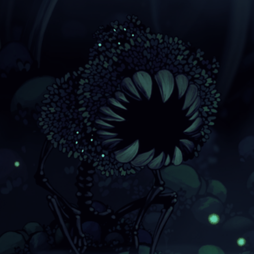

*   [Home](index.html)
*   [Commands](commands.html)

<main>

# About the Bot

This is mostly started out as a hobby and as an idea mainly to replicate the actual hunter's hournal from Team Cherry's videogame: _Hollow Knight._

This bot has only 2-5 commands at the moment and more are coming in the future. If you would like to directly support me you can donate to my [Patreon](https://www.patreon.com/redlagoon) or if you would like to ask some questions or even suggest new features, there will be a support server coming soon. Thank you.

# FAQ (Frequently Asked Questions)

## Why does the bot frquently go "offline"?

I try my best to keep the computer running at all times, hoewever it has a tendency to completely sleep and it stops the program from running the code so I am terrible sorry for that

## What are the commands for the bot?

You can check by going through the navigation tab or by clicking [this](commands.html) link

## Where did you get all the enemy sprites/sources

Literally all of this is from the wiki you can check it out here: _Hollow Knight Fandom WIki_

## Will there be a beastiary that features the enemies from _Silksong_?

I am honestly not sure yet. I am waiting until the game comes out granted there be a silksong equivalent to the hunter's journal in order for me to include these enemies.

</main>

